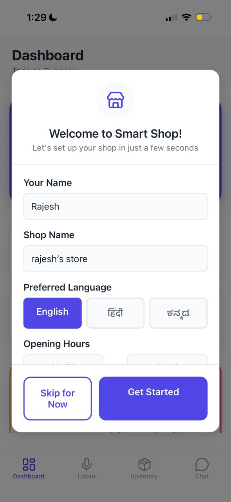
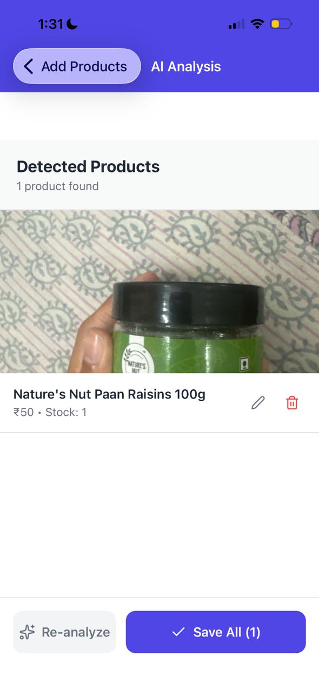
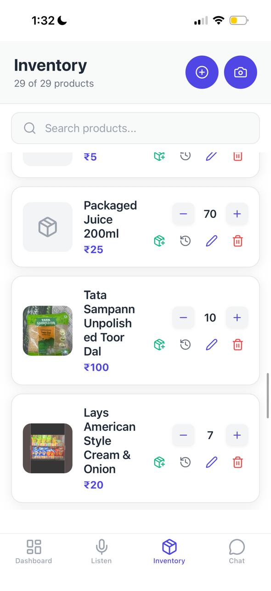
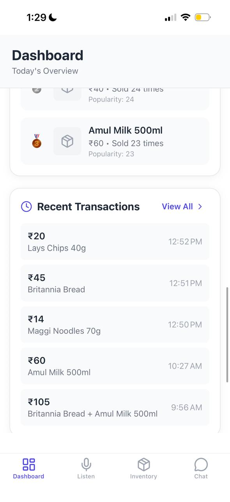
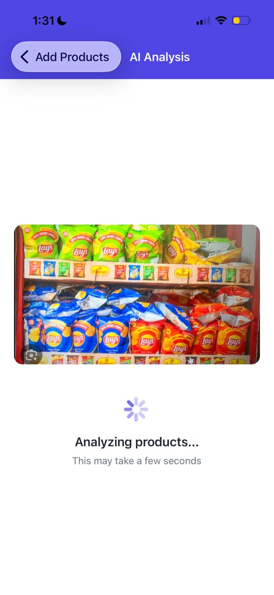
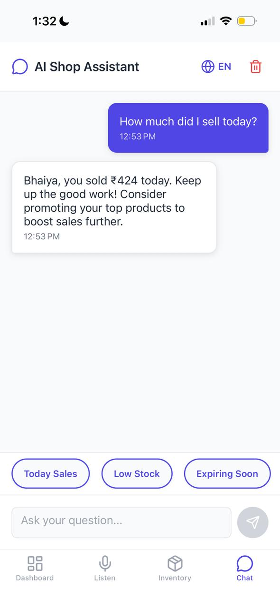

# Smart Shop Assistant

AI-powered inventory management for Indian kirana stores.

## Screenshots

<div align="center">
  
  
  
</div>

<div align="center">
  
  
  
</div>

<div align="center">
  
  
  
</div>

## Features

- **UPI Audio Processing** - Automatically detect payment amounts from UPI sounds
- **AI Product Recognition** - Add products by taking photos of your shelf
- **Multilingual Support** - Works in English, Hindi, and Kannada
- **Smart Analytics** - Track sales, inventory, and get business insights
- **Voice Assistant** - Ask questions about your business in your preferred language

## Quick Start

1. **Install dependencies**
   ```bash
   npm install
   ```

2. **Add your OpenAI API key**
   - Copy `.env.example` to `.env`
   - Add your OpenAI API key to the `.env` file

3. **Start the app**
   ```bash
   npm start
   ```

4. **Scan QR code** with Expo Go app on your phone

## Tech Stack

- React Native (Expo)
- TypeScript
- OpenAI GPT-4 Vision API
- Zustand for state management

## Demo

The app includes sample data and demo modes to showcase all features without requiring real products or payments.

## License

MIT